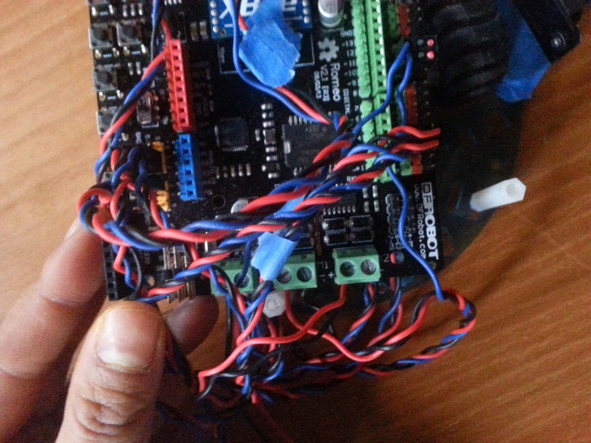
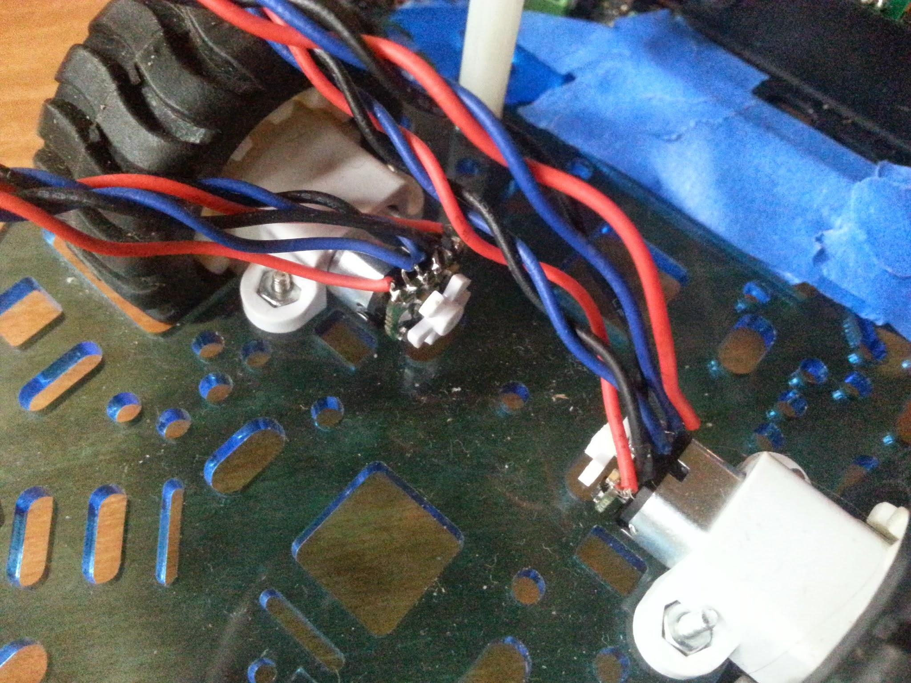
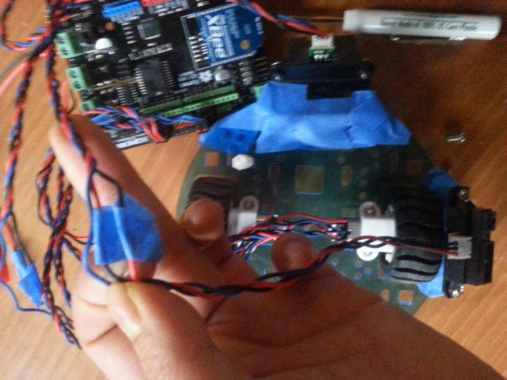
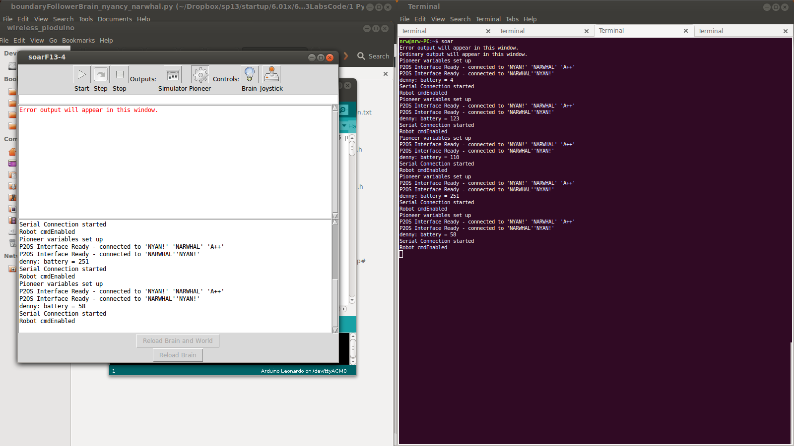
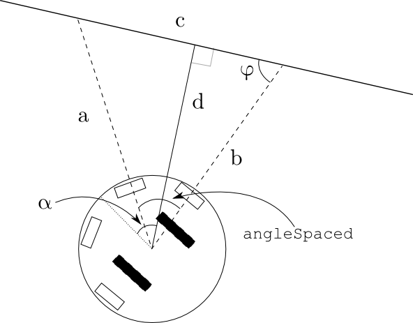
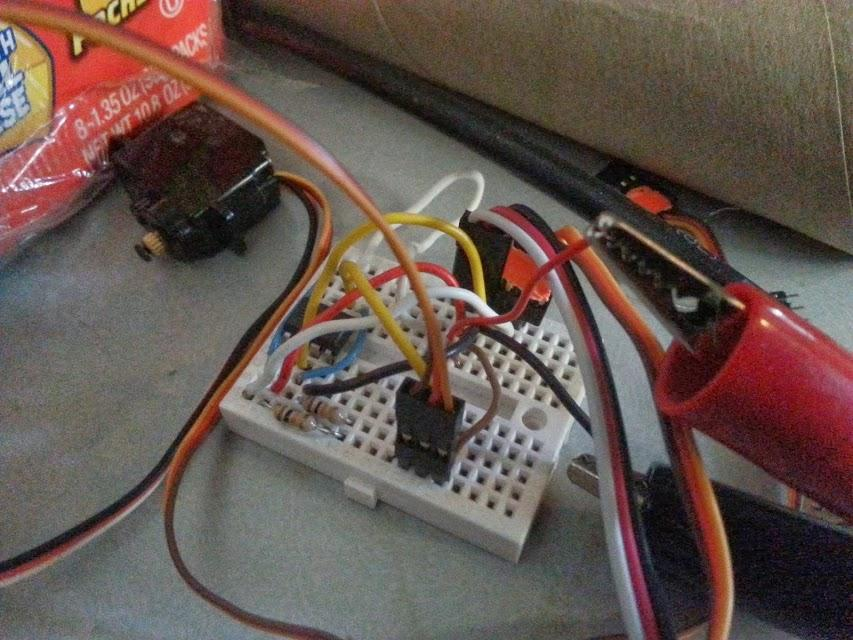
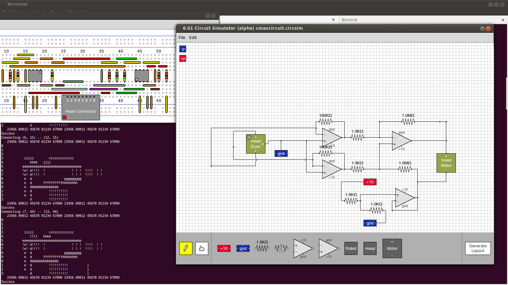
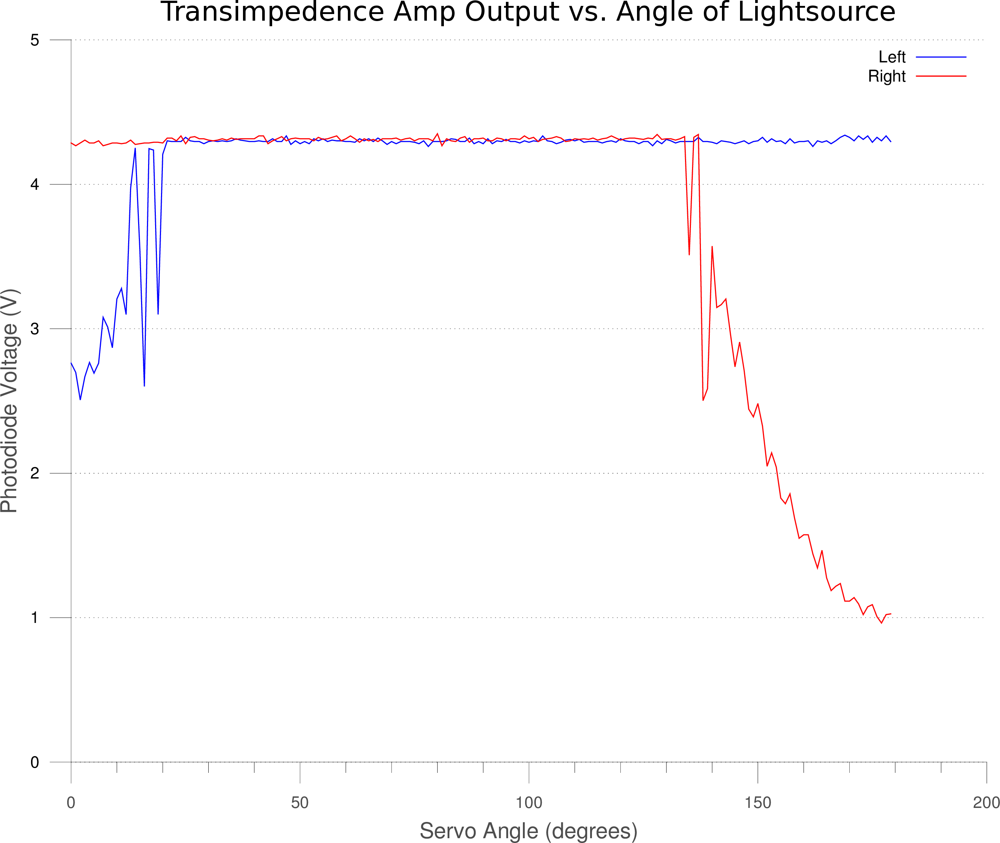

# Introduction

MIT Office of Digital Learning (ODL) contracted NarwhalEdu to create a
replacement for the robots used in 6.01 as of 2013. 

As of 2013, the Pioneer-DX robots are used, with a head consisting of a
lego motor, a custom 3d-printed chassis, and a custom PCB with two
photodiodes on it.

The motivation for our work was twofold:
1. A smaller robot would allow students to do labs at home
2. A cheaper robot would be more reasonable for online students

In this section, a brief retrospective on the work accomplished and
lessons learned follows, and we end with thoughts about future work. In
the appendix, one may find the proposal we submitted to the ODL.

## Timeline
2013
9/9 Proposal submitted
10/9 Supplies ordered as per invoice
  10/15 PO setup for our work by the ODL
  10/16 Invoice submitted by NarwhalEdu
11/11 Ordered the poorly-documented DFRobot MiniQ robot
  11/17 Check cut
  11/22 Check cashed
2014
1/31 First meeting with Prof. Chuang
2/4 Order gyros, IR distance sensors, Romeo controller board, optical
encoders (3.3V by mistake)
2/17 Order 5V optical encoders
2/26 Order 3.3V optical encoders, because they actually work
3/31 Order 300:1 motors, more IR sensors
4/25 Final completion of work

## Summary of Work
In 2013, we evaluated different CPUs, distance sensors, chassis, motors,
and odometry systems. 

We discovered the $79 MiniQ robot, which seemed perfect for our needs,
though it was poorly documented. It was, of course, too good to be true.
The critical two factors were sub-optimal distance and odometry sensing.
In short, we could rig left and right distance sensing, but the sensors
were definitely designed for proximity and not distance sensing. Our
robot was also moving slow enough that we really needed to measure
rotations of the motor, not of the output after the gearbox. (For more
details, see Side Note: Sensors below). However, it did give us the
basis to develop our own robot from scratch and a sense of at what cost
robots could be sold.

As of our first meeting:
CPU: We decided on using Arduino for free and easy-to-use cross-platform
programming toolchain. There was a motor controller - arduino-compatible
board, the Romeo controller, that we found sufficient for our needs.
Distance: We decided on the Sharp IR sensors, since they have a
relatively linear response curve and I knew there was 2.007 code we
could use for them.
Odometry and Chassis: We decided on the pololu round chassis with
high-quality 100:1 gearmotors, since pololu sells them with extended
shafts so that the optical encoders can mount to them. We investigated
gyros but did not end up needing them.

* Note: DFRobot does not sell [knockoff] extended motor brackets that
  cover the gearbox, their "extended" ones are the equivalent of pololu
normal ones, so hair will tend to get caught in them. 

We struggled a lot with the optical encoders. They need thin wires or
else the pads get heat-damaged and fall off. We found servo wires
sufficient for this purpose. Additionally, we bought 3.3V ones by
accident, then bought 5V ones after desoldering a lot of pads, and after
troubleshooting realized that the 5V ones did not generate large enough
signal swing at 5V to trigger the interrupts, but the 3.3 V ones did.

Around this time we also began exploring wireless options, as we found
that the cable to the computer significantly impacted evaluation of the
odometry. Although the previous MiniQ was wirelessly programmable, the
leonardo Romeo board was not. However, this was fine because we learned
that we only needed to wirelessly transmit data. We started with the
xbee, which was the most expensive but the easiest to use given the
pre-existing slot on the romeo. We struggled a lot with the xbee.
Ultimately, a combination of fixing code errors and learning about the
ins and outs of xbees allowed us to create a reliable wireless robot.
(115200 does not exist on the xbee! We ended up using 19200 to avoid any
weird xbee bad rate issues.)

Further work was done to determine that only three IR sensors were
needed to complete the parking lab, however, they had to be
asymmetrically placed. We struggled with the parking lab before
realizing that the real world needed to match the ideal world given to
the robot fairly closely.

### Side Note: MiniQ Documentation
It has
* atmega328p
* cleverly cheap wheel encoders
* spot for an xbee or for the DFrobot Wireless Programming Kit, which
  allows you to wirelessly upload programs
* USB programmable
* a piezo
* lots of LEDs
* pushbuttons
* IRM881T IR receiver that could respond to a keychain remote
* a left and right photoresistor
* two IR LEDs
* 4x ITR2001 optointerupters on the bottom for line-following

### Side Note: Sensors
The IR receiver was a 38kHz receiver. It has a slightly varying response
depending on the strength of the signal received, but in a non-linear
and generally awkward fashion. Conceivably, we could have beeped our two
IR LEDs at 38kHz (alternating, since we only have one receiver, and we
keep track of which are left and which are right) and tried to derive
the distance based on the number of interrupts the IR receiver generates
(DFRobot does provide some sample code that allows you to control the
robot with the remote supplied with the robot), or try short bursts that
get longer and longer until we receive an interrupt, or chirp out a
varying frequency from 36 to 42 kHz and see where we stop getting
interrupts. We could use the photoresistors, but they have slow response
times and wouldn't allow us to modulate at a reasonable frequency so
that we could easily filter out ambient IR. All-in-all, rather
inconvenient, if amazingly cheap. 

We ended up going with the Sharp IR sensors.

The encoder system, developed most likely by pololu originally, worked
thusly: for each wheel, there were two IR20510 light reflection switches
mounted to the chassis. The wheel hub had 12 notches, and as each notch
passed over the switches, it triggered an interrupt. Between the two
reflection switches, this allows the user to treat this system as a
quadrature encoder and be able to detect roughly the speed and whether
the wheel was turning forward or backward. This gives a maximum linear
sensitivity of 3mm. 

See
[http://www.pololu.com/product/1217/resources](http://www.pololu.com/product/1217/resources)
for more information.

This system is cheap and doesn't require any calibration (easy for the
user to assemble), but too low-resolution for our purposes, since we're
always running at low speed. We had difficulty getting the robot to
drive slowly in a straight line with our PID loop. It was limited to 48
ticks per revolution of the wheel, and we had a 100:1 gearbox going at
the time. Ultimately we decided on optical encoders that attached to the
motor shaft directly.

 ## Details
For more details, see our report on Jan 31, 2014 and on March 11, 2014
in the appendix.

## Future Work
Future work lies in resolving where the breadboard should go and
building a better jig for the head than hot glue, as well as resolving
the photodiode wires into a connector. In the short-term this can
involve a two-layer lasercut chassis with the controller on the bottom
and the breadboard on top. In the future we recommend building the romeo
controller into a custom PCB that serves as the bottom layer and allows
the breadboard layer to be attached with standoffs. This shrinks the
diameter required. Additionally, the optical encoders are finicky in
terms of assembly (they require an oscilloscope to calibrate) and we
hope to replace them with a future product of pololu, magnetic encoder
disks with hall effect sensors that can be integrated into the PCB.
Given a large enough order, a factory can directly create the
control-board-less servo with two tails.

In the future, we recommend better communication between the 6.01 staff
and contractors. Most of our questions were answered by former students
we knew.


## BoM

All costs in USD as of March 2014.
<table>
  <tr>
    <td>Name</td>
    <td>Total Cost</td>
    <td></td>
    <td>Product Name</td>
    <td>URL</td>
  </tr>
  <tr>
    <td>Custom Lasercut Chassis (based on pololu)</td>
    <td>$7.95</td>
    <td>pololu</td>
    <td>#1507 Pololu 5" Robot Chassis RRC04A Transparent Light-Blue</td>
    <td>http://www.pololu.com/product/1507</td>
  </tr>
  <tr>
    <td>Lipo Battery Connector</td>
    <td>$0.99</td>
    <td>pololu</td>
    <td>JST RCY Plug with 10cm Leads, Male</td>
    <td>http://www.pololu.com/product/2181</td>
  </tr>
  <tr>
    <td>Lipo Battery</td>
    <td>$4.65</td>
    <td>hobbyking</td>
    <td>Turnigy 1000mAh 2S 20C Lipo Pack</td>
    <td>http://www.hobbyking.com/hobbyking/store/__9170__Turnigy_1000mAh_2S_20C_Lipo_Pack.html</td>
  </tr>
  <tr>
    <td>3x Sharp IR Sensor</td>
    <td>$29.85</td>
    <td>pololu</td>
    <td>#136 Sharp GP2Y0A21YK0F Analog Distance Sensor 10-80cm</td>
    <td>http://www.pololu.com/product/136</td>
  </tr>
  <tr>
    <td>3x Sharp IR mount</td>
    <td>$15.00</td>
    <td>robotmesh</td>
    <td>Sharp IR Sensor Mounting Bracket-GP2Y0A21/GP2Y0A02YK</td>
    <td>http://www.robotmesh.com/sharp-ir-sensor-mounting-bracket-gp2y0a21-gp2y0a02yk?___SID=U</td>
  </tr>
  <tr>
    <td>6x bolts for IR mount</td>
    <td>$1.63</td>
    <td>mcmaster</td>
    <td>Zinc-pltd Stl Pan Head Phillips Machine Screw, 4-40 Thread, 1/2"
Length x 100</td>
    <td>http://www.mcmaster.com/?error_redirect=true#90272a110</td>
  </tr>
  <tr>
    <td>6x nuts for IR mount</td>
    <td>$0.81</td>
    <td>mcmaster</td>
    <td>Zinc-plated Steel Machine Screw Hex Nut, 4-40 Thread Size, 1/4"
Width, 3/32" Height x 100</td>
    <td>http://www.mcmaster.com/?error_redirect=true#90480A005</td>
  </tr>
  <tr>
    <td>2x 100:1 Gearmotor</td>
    <td>$33.90</td>
    <td>pololu</td>
    <td>#2214 100:1 Micro Metal Gearmotor HP with Extended Motor
Shaft</td>
    <td>http://www.pololu.com/product/2214</td>
  </tr>
  <tr>
    <td>42x19mm Wheel, pair</td>
    <td>$3.85</td>
    <td>robotmesh</td>
    <td>Wheel 42x19mm (Pair)</td>
    <td>http://www.robotmesh.com/wheel-42x19mm-pair</td>
  </tr>
  <tr>
    <td>Extended Motor Bracket, Pair</td>
    <td>$2.99</td>
    <td>pololu</td>
    <td>#1089 Pololu Micro Metal Gearmotor Bracket Extended Pair</td>
    <td>http://www.pololu.com/product/1089</td>
  </tr>
  <tr>
    <td>2x Optical Encoder</td>
    <td>$17.90</td>
    <td>pololu</td>
    <td>#2591 Optical Encoder Pair Kit for Micro Metal Gearmotors,
3.3V</td>
    <td>http://www.pololu.com/product/2591</td>
  </tr>
  <tr>
    <td>2x Caster</td>
    <td>$3.80</td>
    <td>Robotmesh</td>
    <td>MiniQ Ball Caster Metal</td>
    <td>http://www.robotmesh.com/ball-caster-metal-miniq</td>
  </tr>
  <tr>
    <td>3x Standoff</td>
    <td>$2.00</td>
    <td>Robotmesh</td>
    <td>10 sets M3 * 30 nylon standoffs</td>
    <td>http://www.robotmesh.com/10-sets-m3-30-nylon-standoffs</td>
  </tr>
  <tr>
    <td>7x 3 wire</td>
    <td>$6.00</td>
    <td>Robotmesh</td>
    <td>Analog Sensor Cable For Arduino (10 Pack)</td>
    <td>http://www.robotmesh.com/analog-sensor-cable-for-arduino-10-pack</td>
  </tr>
  <tr>
    <td>Romeo Controller</td>
    <td>$39.90</td>
    <td>Robotmesh</td>
    <td>Romeo V2-All in one Controller</td>
    <td>http://www.robotmesh.com/romeo-v2-all-in-one-controller</td>
  </tr>
  <tr>
    <td>Head Servo</td>
    <td>$5.00</td>
    <td>Emax</td>
    <td>ES08DE Digital Servo</td>
    <td>http://www.emaxmodel.com/views.asp?hw_id=1247</td>
  </tr>
  <tr>
    <td>Long Servo Extension Cable</td>
    <td>$0.7</td>
    <td>Robotmesh</td>
    <td>Servo Extension Cable 300mm</td>
    <td>http://www.robotmesh.com/servo-extension-cable-300mm</td>
  </tr>
  <tr>
    <td></td>
    <td></td>
    <td></td>
    <td>Subtotal</td>
    <td>$176.92</td>
  </tr>
  <tr>
    <td>Wireless</td>
    <td></td>
    <td></td>
    <td></td>
    <td></td>
  </tr>
  <tr>
    <td>2x Xbee</td>
    <td>$41.90</td>
    <td>Robotmesh</td>
    <td>XBee 1mW Trace Antenna - Series 1 (802.15.4)</td>
    <td>http://www.robotmesh.com/xbee-1mw-trace-antenna-series-1-802-15-4</td>
  </tr>
  <tr>
    <td>Xbee USB Adapter</td>
    <td>$18.50</td>
    <td>Robotmesh</td>
    <td>XBee USB Adapter V2</td>
    <td>http://www.robotmesh.com/xbee-usb-adapter-v2</td>
  </tr>
  <tr>
    <td>USB Mini Cable</td>
    <td>$1.90</td>
    <td>Robotmesh</td>
    <td>Mini USB cable</td>
    <td>http://www.robotmesh.com/mini-usb-cable</td>
  </tr>
  <tr>
    <td></td>
    <td></td>
    <td></td>
    <td>Total</td>
    <td>$239.22</td>
  </tr>
</table>

## Assembly Instructions
See bill of materials for needed parts. Additionally, wire strippers, #0 and #1 screw drive, tape, hot glue gun, and soldering iron needed.

### Wiring Diagram


### Wiring Picture



### Step-by-step Instructions

**Motor Unit Assembly**

1. Solder optical encoder to motor. Try to make sure the IR sensors are an equal distance from the motor back end, that way as the white encoder disc spins they are triggered equally.
2. Strip two of the 3-wires. Solder them to the as in the picture above -- red1-blue1-blue2-black1-black2. 
Future wiring notes:
 1. 3-wire number 1 will be plugged into one of the digital pin breakouts
 2. 3-wire number 2 will be plugged into another digital pin and then the black and red wires on it will be cut, stripped, and put into the motor output terminals on the romeo
3. Tune with oscilloscope and plastic screwdriver until the bottom of the waveform dips to zero (below 0.2V) (or else it won't trigger the interrupt as a V_low) (see [http://www.pololu.com/product/2590](http://www.pololu.com/product/2590) for more details)
4. Put motor bracket on motor
5. Put wheel on motor shaft
6. Repeat for other motor

**Sensor Unit Assembly**

1. Screw IR sensor onto L-shaped IR mount
2. Swap the red and black wires by cutting, stripping, and soldering them, on the 3-wire analog connector (this is because the romeo controller goes  SIG 5V GND instead of the SIG GND 5V that the IR sensors wants). See below.



3. Electrically insulate the two wires (blue tape is used above)
4. Plug the leftmost sensor into analog pin 1, center-right into analog pin 2, and right sensor into analog pin 3

**Servo Head Assembly**

1. Take off bottom part of case (unscrew 4 screws with a #0 screwdriver)


2. Desolder control board
3. Resolder 3-wire leads to motor
4. Cut and strip a new 3-wire (ideally a servo extension cable, the analog cables are fine electrically but physically may not lie flat enough to exit the servo case smoothly)
5. Solder 3-wire leads to potentiometer


6. Place leads appropriately so that you can put the case back on


7. Attach a lasercut wooden piece to it that fits the servo spline with a screw and a washer. Solder breadboard wires to two photodiodes, then hotglue the photodiodes down to the wooden piece such that they are facing 90 degrees apart from each other
8. Hot glue the servo down to the breadboard on one end (in row 55+ range).


**Robot Assembly**

1. Screw motor bracket down to chassis
2. Tape IR sensors to appropriate positions -- directly left and right, and then a third one to the right of center. There should be **65 degrees **between right and center-right sensors, although this number is fairly arbitrary. (We simply taped it down, measured the angle using a protractor pulled up on our laptop screen, and hardcoded it in -- see later documentation)
3. Screw casters onto bottom of chassis -- make sure to take out the plastic piece on top of the balls (there should be two casters, on up front and one in the back)
4. Screw standoffs to chassis
5. Screw romeo controller to standoffs


**Program Xbees**

1. Boot into windows and install XCTU. It is a large piece of software.
2. Program the xbees to talk to each other (DL and MY commands)
   1. Plug one xbee into a USB explorer and connect to computer
   2. Under Device Manager, note which serial port 
   3. Click "Add'
      1. Serial port: use the one noted in Device Manager
      2. If factory xbee, try 9600 baud rate. Otherwise, try the last baud rate you remember, and otherwise just try process of elimination
  4. Click on the device
  5. **Change DL and MY appropriately. e.g. for xbee1, you can set MY=1111 and DL=2222. Then for the other xbee, you would set MY=2222 and DL=1111.**
  6. Set the **baud rate to 19200**
  7. Make sure the channel and pan id are the same for both devices
  8. Optionally, set the node identifier (some human-recognizable name)
  9. The software is a little buggy, if you cannot get rid of the DH (set it to zero) after accidentally setting it to something nonzero, go into the console tab, hit connect
      1. Add a packet -- "+++" .
      2. Send selected packet -- you should get an "OK" in response letting you -know the device is awake. Note that the device falls asleep fairly quickly.
      3. Add packet -- "ATMY[enter]" (the enter is important!). Send it. You should receive the current MY back.
      4. To change the DH, add a packet -- "ATDH0[enter]" and send it. You should get "OK" back.
      5. Add a packet -- "ATWR[enter]" and send it. You should get an "OK" back. **This writes changes to flash.**
      6. You can hit disconnect, unplug and re-plug in the xbee, reconnect it, and let XCTU read all the values to double-check that you changed the value you wanted to change.

**Robot Wiring**

1. Cut and strip two leads on one of the 3-wires for the motor
2. Plug in / screw leads for motor to M1/M2 and digital pins
3. Plug in IR sensor to analog input pins
4. Plug in Xbee
5. Screw in JST 2-wire XH-style lipo male connector
6. Plug-in battery

**Program Arduino**

1. Install the Arduino IDE by following the directions [here](http://arduino.cc/en/Guide/HomePage).  If you're using Ubuntu I recommend getting the .debs from Debian Sid outlined near the bottom of [this page](http://playground.arduino.cc/Linux/Ubuntu).  They are more up to date.  You need Arduino version 1.0.1 or greater to program the Arduino Leonardo
2. Download the [wireless_pioduino folder](https://github.com/mitocw/mit-6.01-NarwhalEdu-robot/tree/master/code/wireless_pioduino).  Open up [wireless_pioduino.ino](https://github.com/mitocw/mit-6.01-NarwhalEdu-robot/blob/master/code/wireless_pioduino/wireless_pioduino.ino).
3. Select Tools>Board>Arduino Leonardo and Tools>Serial Port>YOUR\_ARDUINO\_PORT \(to find YOUR\_ARDUINO\_PORT\ on Linux just plug in the Arduino, go to a terminal and enter `dmesg | tail` the Arduino Leonardo should show up as `/dev/ttyACMx` where x is usually `0` or `1`)
4. Hit upload

5. The Leonardo should blink its lights as the program is uploading once it's done the robot is ready to go.  Sometimes the upload fails on the first try this seems to be a common problem with the Leonardo.

## Software

At this point you should have a completed robot with a battery and an xbee ready to be connected to your computer.

1. Install [lib601](https://github.com/mitocw/mit-6.01-NarwhalEdu-robot/blob/master/lib601.tar.gz) from the 6.01 website.
2. Then replace **/usr/local/lib/python2.7/dist-packages/soar/outputs/pioneer.py** with the NarwhalEdu [pioneer.py](https://github.com/mitocw/mit-6.01-NarwhalEdu-robot/blob/master/code/pioneer.py) 
3. Connect the xbee to the computer
4. Open a terminal and run "dmesg | tail". Note which port is connected -- usually /dev/ttyUSB0 or /dev/ttyACM0.
5. Inside pioneer.py (must be admin to edit this file), edit the line appropriately settings.SERIAL_PORT_NAME = "/dev/ttyUSB1"
6. Run soar from the terminal
7. Click **pioneer** to connect to the robot. If the button stays depressed for a few seconds, that means that you have the right serial port but are having issues connecting to the robot. If it comes depressed right away, check that you edited pioneer.py with the appropriate serial port. If it's connected, it should look like below:



8. If you continue experiencing issues connecting to the robot: hit reset and wait a few seconds (the xbees appear to take a second or two to initialize). Second, try turning the robot on and off. Try replugging the xbee into your computer. Try restarting SOAR. 
9. After it's connected, hit **brain** and load the appropriate brain python file you have written.
10. Hit the square STOP button to stop running the program, and then Reload Brain **and World **if you are going to be moving the robot.
11. Watch out if the robot ever stops responding or is behaving oddly -- is it still connected to SOAR? and if so, are the batteries low?
12. Other things that are good to check initially -- are the left and right motors mapped in code correctly, are the directions of each motor mapped correctly, are the IR sensors mapped correctly
13. Debugging tip: Robot can be put on top of two wire spools with the casters sitting inside the spools to debug the motors without having it drive all over the place

# SOAR

Only [pioneer.py](https://github.com/mitocw/mit-6.01-NarwhalEdu-robot/blob/master/code/pioneer.py) was modified, sonarDist should be modified (discussed below)
We altered pioneer.py in the following ways:

1. `MAX_TRANS` now equals 0.2
2. `RADIAN_SCALE` now equals pi/180
3. `sonarsChanged`, `storedsonars`, `oldsonars`, `changed`, and `sonars` are now only size 3
4. `baudRates` to include 19200
5. `timeout` to 0.5
6. the missed packets criteria (`self.zero_recv_cnt`) to be 100 which is ~25 lost packets
7. `bufferidx `is now 4 (because IO packet size changed)
8. analog inputs are multiplied by 5/1023 instead of 10/1023 because system voltage is only 5
9. stallbump is no longer in the SIP packet, so all lines relating to that are commented out
10. SIP packet changed size so all numbers within it are different

# Code Changes

-> sonars are numbered differently

The only change to how the lab code is written is the sonar numbering.  There are only 3 sonars so `inp.sonars` and `io.getSonars()`will only return a list of length 3.  The convention is the same with `sonar[0]` being the most left and the index increasing as you go right.  `sonarMax` should be only ~0.80m that’s the range of the IR sensors in the spec sheet.

The only internal function used we found that fails because of this difference is `getDistanceRightandAngle()`, but other functions that we didn’t come across may also have errors.  Here’s the code we used in place of it, but presumably you can just edit sonarDist to correct the indices and and spacing of sensors.  In our case, we measured 65 degrees between the right sensor and right-center sensor.

```python
def getDistanceRightAndAngle(s):
    angleSpaced = 65*math.pi/180
    right = s[2]
    center = s[1]
    sonarMax = 0.8
    if right < sonarMax and center < sonarMax:
        radius = 0.089/2
        a = center+radius
        b = right+radius
        c = math.sqrt(a*a+b*b-(2*a*b*math.cos(angleSpaced)))
        phi = math.asin((a/c)*math.sin(angleSpaced))
        if phi > math.pi/2:
                d = b*math.sin(phi-math.pi/2)
                  alpha = math.acos(d/b)
                theta = -alpha
        else:
                d = b*math.sin(phi)
                if d/a > 1:
                    return(right,None)
                alpha = math.acos(d/a)
                   theta = alpha-angleSpaced
        return(d,theta)
    elif right < sonarMax:
            return(right, None)
    elif center < sonarMax:
            return(center, None)
    else:
            return(sonarMax, None)
```




**Differences from Pioneer OS:**

Basically, the Arduino is running a much simpler pioneer OS v3.  

* All the commands that 6.01 seems to use currently were implemented.  Many of the rest are empty case statements.
* There are ~5960 encoder ticks per revolution of the wheels
* Since soar ignores a lot of the information in SIP packets and to improve wireless communication the SIP packets were reduced in size the standard SIP only sends position and sonar information so its maximum size is 17 bytes.  The IO SIP is also only 17 bytes but only bytes 0 and 9-14 (numbering excludes header) are nonzero, the others were left in in case more analog inputs would need to be used but currently I believe soar ignores them.
* Again there are only 3 IR sensors not 8.  Each reported reading is the average of 5 values taken from the sensor.

# Labs


### Lab 1

Part 1. Robot maintains distance from a foamboard wall in front of it.

1. Load the [boundaryFinder brain](https://github.com/mitocw/mit-6.01-NarwhalEdu-robot/blob/master/code/designLab01/boundaryFinderBrain_narwhal.py).
2. Move foamcore backwards and forwards. Robot should follow it (even though there is no center IR sensor, we use the center-right one and it is sufficient).

Part 2. Robot maintains distance from a wall on the right-hand side.

1. Load the [boundaryFollower brain](https://github.com/mitocw/mit-6.01-NarwhalEdu-robot/blob/master/code/designLab01/boundaryFollowerBrain_narwhal.py).
2. Set the foamcore upright on the right-hand side of the robot. Hit
   play.

### Lab 6

1. Setup a foamcore wall on the right side
2. Set the robot 0.4 meters from the wall, rotated at about pi/8. 
3. Set the bulls eye (created out of foam and a paperclip) up about 1
   meter in front of the robot, 0.3 meters from the wall.
4. Tape a pen to the top of the robot.
5. Load the [angle brain](https://github.com/mitocw/mit-6.01-NarwhalEdu-robot/blob/master/code/designLab06/angleBrain_narwhal.py) and hit run. Robot should go towards the wall, reach
   its desired distance from the wall, and then follow the wall until
   it lances the bullseye.
6. Adjust the height of the bullseye as needed.

Brain-wise, kp = 10 and ka = 1.99899 work well with desiredRight = 0.3.


### Lab 8

Use male headers to connect motor and potentiometer to breadboard as appropriate. Note that the 10V source in all the following diagrams is replaced by a 5V source. **Use the L272 op-amp (****[http://sicp-s4.mit.edu/cat-soop/6.01_S14/circuit**s](http://sicp-s4.mit.edu/cat-soop/6.01_S14/circuits)**) as it is capable of sourcing enough current for this application.**

Section 4.2 Checkoff 1: Buffered potentiometer divider circuit, Control motor speed with potentiometer (single direction)

* Materials: breadboard, 5V from the romeo board, pot, L272 op-amp, and motor

* 

Section 5 Checkoff 2: Bidirectional Speed Controller, Control motor speed with pot (bidirectional)

Build this circuit:

* Materials: breadboard, 5V from the romeo board, pot, L272 op-amp, two equivalent value resistors probably of at least 5k, and motor

* 

Section 6 Checkoff 3: Angular Position Controller, Control motor angle with pot

* Materials: breadboard, 5V from the romeo board, pot, L272 op-amp, a servomotor

* Simply replace the voltage divider circuit in the previous part of the lab with the potentiometer output from the servomotor.

*  
(the output from the voltage divider in this picture is not being used, the resistors just haven't been pulled out)

### Lab 9

To create a head that tracks light, we use the output from two Silonex SLD-701R2A IR photodioes. A circuit such as below would work:



Namely, two transimpedance amps to convert current from the photodiodes into voltage, fed into a differential amplifier, that is then fed to the motor. On the other side of the motor we have the standard voltage divider circuit circuit fed into a buffer that is then fed into the motor.

If you have issues with the head railing to one side when there is no direct light source, **check the gains** on the transimpedance amps. The gains may be too high and the op-amps are hitting their rails.

Note: Use 330K instead of 1M on the differential amplifer or else the head will rail to one side when no light is present.  330K is the largest standard resistor that can be used without railing

### Lab 10

This lab requires a fairly intense IR source (a lamp works, we haven't
tried it with IR keychains yet). 

1. Connect the servomotor potentiometer lead to power, ground, and to
   analogPin10(labeled 10). Connect the left photodiode voltage (output of the
   transimpedance amp) to analogPin4 (labeled A4), and the right one to analogPin5 (labeled A5).
   Connect 5V and GND to the breadboard rails from the controller.

 

2. Load the [rover brain](https://github.com/mitocw/mit-6.01-NarwhalEdu-robot/blob/master/code/designLab10/roverBrain_narwhal.py). Run it. The robot should attempt to maintain a
   distance from the light by both following and retreating, as well as
   maintaining its position when there is no light.  
3. Values in the code that will depend on the light source: the exact thresholds for
   the photodiode voltages (to find these, just print out the IR
   readings vLeft and vRight and move the light around while commenting out
   all the setForwards that are non-zero)
   Note that the code is written in a way that when it decides the light is
   too close, it will rapidly move away from it and then slowly move
   away from it. This is just the way we chose to implement the lab.

Here's a graph of the photodiode output using a big lamp.




### Lab 13

In this lab the robot follows a wall on the right and parks itself in
the second gap ("parking space") it finds. 

1. As per the world file (and see the video for reference), set up 
three blocks, each 50 cm long, with 75 cm gaps between them. In each of the two
gaps, set a block further back. The first column of blocks should be
about 0.8 m from the wall, and the second column should be about 1.2 m
(fairly arbitrary, as long as the robot has space to turn and move into
the "parking space"). If your blocks are too short, that's fine, but
keep the start of the blocks consistent (so the robot just encounters
longer gaps than it expects).
2. Set the robot at one end, load the [localize brain](https://github.com/mitocw/mit-6.01-NarwhalEdu-robot/blob/master/code/swLab13/localizeBrain_narwhal.py), and hit run
3. Robot should proceed until the beginning of the third block, abruptly
   decide where it is, and initiate parking procedure. 
4. Parking procedure: it back up, turn 90 degrees, and move forward into
   the parking spot.

## Videos

- Lab 1. Wall Find [http://www.youtube.com/watch?v=qMBVbE07Tbg](http://www.youtube.com/watch?v=qMBVbE07Tbg)
- Lab 6. Bulls Eye [https://www.youtube.com/watch?v=fWD04yWnOBU](https://www.youtube.com/watch?v=fWD04yWnOBU)
- Lab 8. Head with potentiometer[ http://www.youtube.com/watch?v=5r9yhMpieDI](http://www.youtube.com/watch?v=5r9yhMpieDI) (position control with motor pot and external pot shown)
- Lab 9. Head with photodiode[ http://www.youtube.com/watch?v=XeEDuTtJMeo](http://www.youtube.com/watch?v=XeEDuTtJMeo)
- Lab 10. Robot with Head [https://www.youtube.com/watch?v=qIvbUR9brPU](https://www.youtube.com/watch?v=qIvbUR9brPU), Rotational Only: [https://www.youtube.com/watch?v=JFF51LcxRAY](https://www.youtube.com/watch?v=JFF51LcxRAY)
- Lab 13. Parking (a) overhead shot (to view any wall-following wobble) [https://www.youtube.com/watch?v=gBMiRD48gqk](https://www.youtube.com/watch?v=gBMiRD48gqk)
     (b) with view of screen / position estimation bars [https://www.youtube.com/watch?v=aKtX0ltPgmw](https://www.youtube.com/watch?v=aKtX0ltPgmw)
